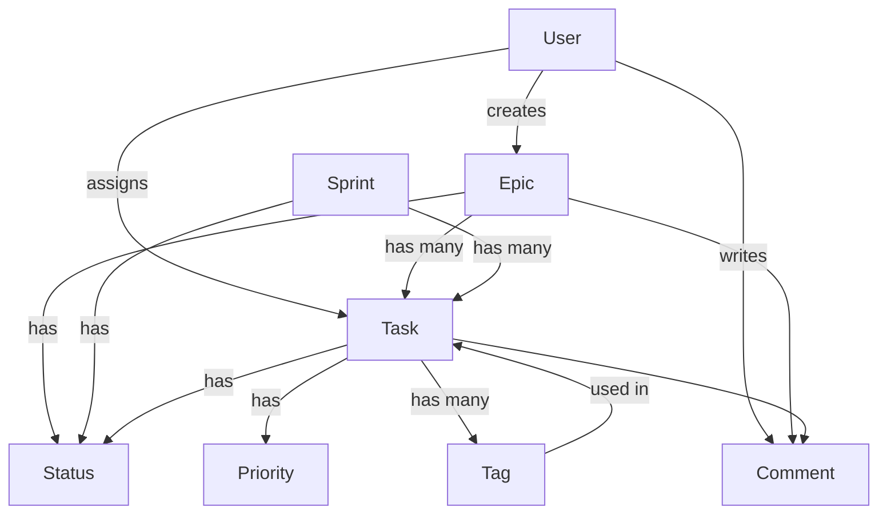
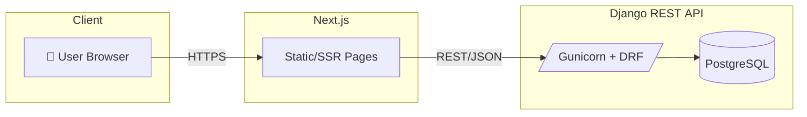

## 🧠 DevTracker

A Jira-style task management app featuring modern UI, drag-and-drop task board, commenting, authentication, and more.

## ✨ Features

- JWT authentication
- Create/update/delete tasks
- Drag-and-drop task board
- Assign users, priority, tags
- Commenting system
- Zod validation + React Hook Form
- Zustand + React Query state management
- Jest unit testing & Cypress E2E
- Best practices (modularization, code splitting, lazy loading, etc)

## 🛠️ Tech Stack

- **Frontend:** React, TypeScript, Tailwind CSS
- **State:** Zustand, React Query
- **Forms & Validation:** React Hook Form, Zod
- **Testing:** Jest, Cypress
- **Auth:** JWT

## 📸 Screenshots

| Dashboard                |  Detailed Task Card |
:-------------------------:|:-------------------------:
 | 

## 🚀 Getting Started

Check out the deployed app [here](https://devtrackerapp.netlify.app/dashboard)

```bash
# Clone the repo
git clone https://github.com/your-username/devtracker.git

# Install dependencies
npm install

# Start the dev server
npm run dev

```

## 📝 Testing

✅ Unit Testing: via Jest
```
npm test
```

✅ E2E Testing: via Cypress for full user MVP flow and interaction coverage
```
npm run cypress:open
```

| Jest                |  Cypress E2E |
:-------------------------:|:-------------------------:
 | 

## ⚡ Google Lighthouse Metrics


## 📰 Entity Relationship Model




## 📂 Folder Structure
```
src/
├── app/ # Main application routes
│ ├── layout.tsx # Root layout
│ ├── dashboard/ # Dashboard feature
│ │ ├── page.tsx # Dashboard page
│ │ └── components/ # Dashboard components
│ │ ├── TaskCard/ # Reusable task component
│ │ ├── TaskForm/ # Task creation form
│ │ └── Column/ # Kanban column component
│ ├── login/ # Login feature
│ └── components/ # Shared UI components
│ ├── BackendSpinUpNotice.tsx # Display notice while BE spins up
│ ├── CustomModal.tsx
│ ├── NavBar.tsx
│ └── FilterButton/ # Filter component with sub-components
│
├── lib/ # Core application logic
│ ├── api/ # API service layer
│ │ ├── tasks.ts # Task-related API calls
│ │ └── auth.ts # Authentication service
│ └── types/ # TypeScript definitions
│
├── hooks/ # Custom React hooks
│ ├── useTasks.ts # Task management hook
│ ├── useUsers.ts # User data hook
│ └── useClickOutside.ts # UI interaction hook
│
├── context/ # React context providers
│ ├── AuthProvider.tsx # Authentication context
│ └── QueryClientProvider.tsx # React Query provider
│
├── store/ # Zustand/state management
│ ├── useTaskStore.ts # Task state
│ └── useUsersStore.ts # User state
| └── useMiscStore.ts # Status, priorities, etc state
│
├── assets/ # Static assets
└── middleware.ts # Middleware
```
